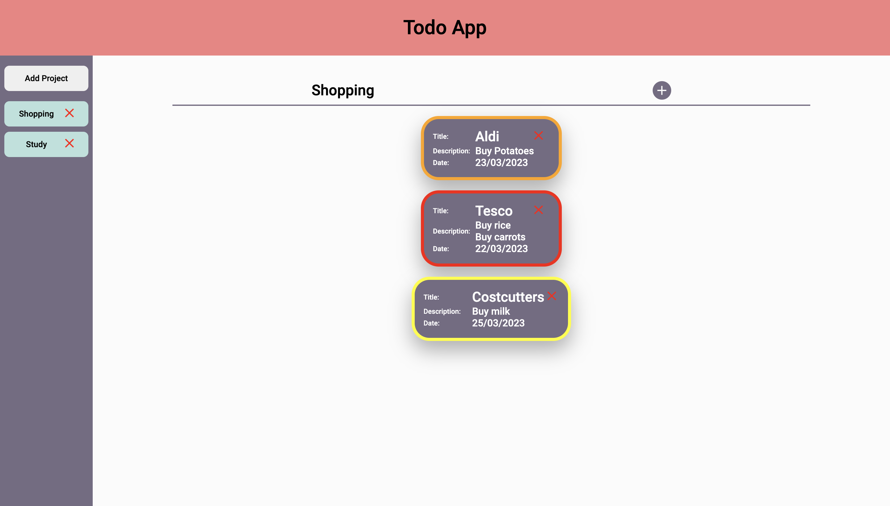

# Todo App

- An app to keep track of tasks
- Create a project and store tasks in that project
- Set the name, description, due date and priority level of the task

## Demo
[view here](https://caolancode.github.io/Todo-App/)

## Image of app

